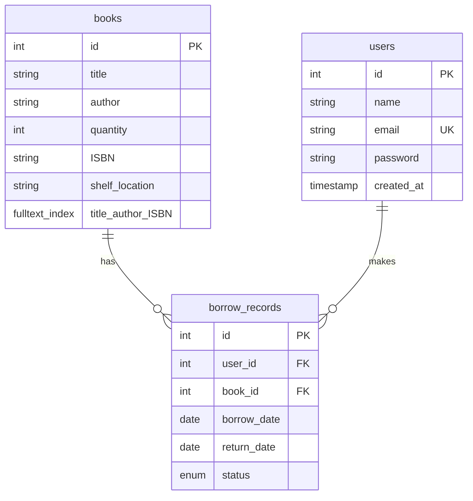

# 📚 Library Management System API

A comprehensive API for managing books, users, and borrowing records in a library system.

## 🚀 Getting Started

### Prerequisites
- Docker
- Docker Compose

### Installation
1. Clone the repository
2. Run the startup script:
```bash
./startup.sh
```

> **Note:** The MySQL database container may take some time to initialize on first startup. Subsequent starts will be instant.

## 🔑 API Documentation

### Books Management

#### Get All Books
```bash
GET /api/books/all
```

#### Create Book
```bash
POST /api/books
Content-Type: application/json

{
    "title": "The Great Gatsby",
    "author": "F. Scott Fitzgerald",
    "ISBN": "9780743273565",
    "quantity": 5,
    "shelf_location": "Fiction-A1"
}
```

#### Update Book
```bash
PUT /api/books/:id
Content-Type: application/json

{
    "quantity": 12
}
```

#### Delete Book
```bash
DELETE /api/books/:id
```

#### Search Books
```bash
GET /api/books/search?term=:searchTerm
```

### User Management

#### Get All Users
```bash
GET /api/users/all
```

#### Create User
```bash
POST /api/users
Content-Type: application/json

{
    "name": "John Doe",
    "email": "john@example.com",
    "password": "securepassword"
}
```

#### User Login
```bash
POST /api/users/login
Content-Type: application/json

{
    "email": "john@example.com",
    "password": "securepassword"
}
```
> Returns a cookie with user authentication token

#### Update User
```bash
PUT /api/users/:id
Content-Type: application/json

{
    "name": "John Smith"
}
```

#### Delete User
```bash
DELETE /api/users/:id
```

### Borrowing Management

#### Get All Borrow Records
```bash
GET /api/borrows/all
```

#### Borrow a Book
```bash
POST /api/borrows
Content-Type: application/json
token: <user_id>

{
    "book_id": 1,
    "return_date": "2025-01-01"
}
```

#### Get User's Borrow History
```bash
GET /api/borrows/user/:userId
```

#### Get Overdue Books
```bash
GET /api/borrows/overdue
```

#### Return a Book
```bash
PUT /api/borrows/return
Content-Type: application/json
token: <user_id>

{
    "book_id": 1
}
```

#### Update Borrow Record
```bash
PUT /api/borrows/update/:id
Content-Type: application/json

{
    "return_date": "2026-01-01"
}
```

#### Get Library Statistics
```bash
GET /api/borrows/stats?start_date=2022-01-01&end_date=2026-01-01
```

#### Delete Borrow Record
```bash
DELETE /api/borrows/:id
```

## 📝 Response Formats
All API endpoints return JSON responses. Successful requests will receive appropriate HTTP status codes (200, 201, etc.).

## 🔒 Authentication
Most endpoints require authentication via a token header. This token is obtained after login and should be included in subsequent requests.

## 🐛 Error Handling
The API returns appropriate HTTP status codes and error messages in case of failures.

## 💾 Database Schema

The database initialization SQL code can be found at `database/db-init.sql`. The schema includes three main tables with the following relationships:



### Key Features:
- Full-text search capabilities for books
- Automatic timestamps for user creation
- Enumerated status for borrow records
- Cascading deletes for maintaining referential integrity
- Unique constraint on user emails

---
For more information or support, please open an issue in the repository.
